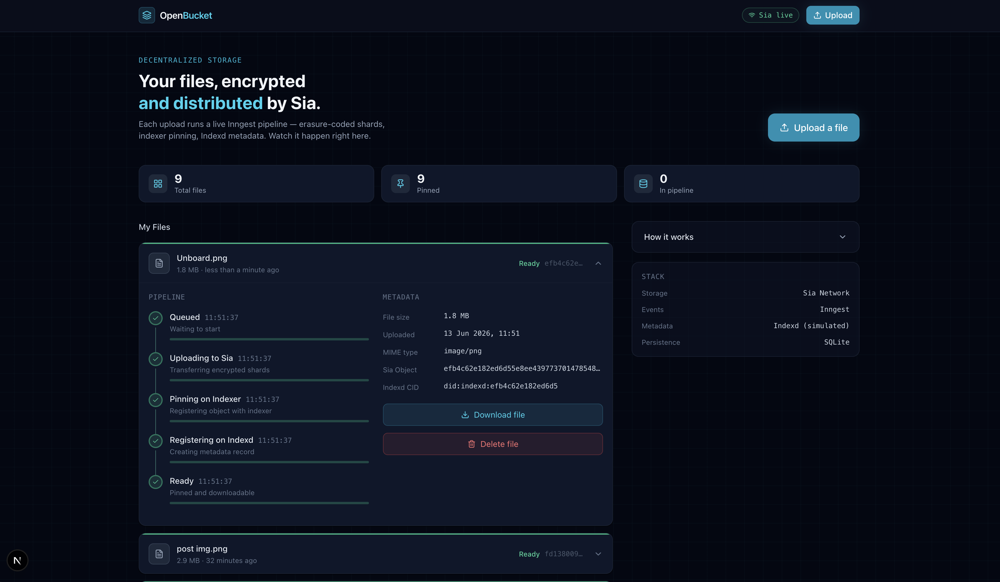

<p align="center">
  <a href="https://youtu.be/gr8vbJhqoEA" target="_blank">
    
  </a>
  <br />
  <em>▶️ Click to watch the demo on YouTube</em>
</p>

# OpenBucket

A live demo of file pinning via the Sia decentralized storage network, driven by an Inngest event pipeline and served through a Next.js UI.

## What it shows

Upload a file → watch it move through four pipeline stages in real time → download it back. Every step is a durable Inngest function, so the pipeline survives crashes and restarts.

```
Upload → Sia erasure-coding → Indexer pin → Indexd metadata → Ready
```

## Stack

| Layer | Tech |
|-------|------|
| Frontend | Next.js 15, TypeScript, Tailwind CSS, Framer Motion |
| Backend | Express + TypeScript |
| Events | Inngest (local dev server) |
| Storage | Sia via `@siafoundation/sia-storage` SDK |
| Metadata | Indexd (simulated — no public write API) |
| Persistence | In-memory (backend) + localStorage (browser) |

---

## Running it

```bash
docker compose up --build
```

| Service   | URL                        |
|-----------|----------------------------|
| Frontend  | http://localhost:3000       |
| Backend   | http://localhost:4000       |
| Inngest   | http://localhost:8288       |

That's it. The first time the backend boots it tries to connect to `https://sia.storage`. If it can't reach the indexer in time (or you haven't approved the app), it falls into **demo mode** — uploads are simulated with realistic delays and fake object IDs. The UI is identical either way; the mode badge in the top nav tells you which you're in.

---

## Connecting a real Sia indexer

The Sia SDK requires a one-time approval flow:

1. Set `SIA_APP_ID` in `docker-compose.yml` to a real 32-byte hex string (your app's stable identity).
2. Start the stack in detached mode:
   ```bash
   docker compose up --build -d
   ```
3. Tail the backend logs to find the approval URL:
   ```bash
   docker compose logs backend -f
   ```
   Look for a line like:
   ```
   [Sia] Open this URL to approve the app: https://sia.storage/approve?...
   ```
4. Copy that URL into your browser and approve the connection.
5. Once approved, press `Ctrl+C` to stop following the logs, then restart the stack so the backend reconnects with the newly stored key:
   ```bash
   docker compose restart backend
   ```
   Or stop and start everything cleanly:
   ```bash
   docker compose down && docker compose up --build -d
   ```
6. Verify the connection: the top-nav badge in the UI should show **Sia live** instead of **Demo mode**.

After the first approval the backend reconnects automatically on every restart using the stored key — no user action required.

**Recovery phrase:** On first boot the backend auto-generates a BIP-39 recovery phrase and writes it to `/app/data/phrase.enc` inside the container (mounted from the `sia-keys` volume). In a production app you'd ask the user for their own phrase and never store it. For this demo, automatic generation keeps the setup frictionless.

---

## Project layout

```
openbucket/
├── docker-compose.yml
├── backend/
│   ├── Dockerfile
│   ├── package.json
│   └── src/
│       ├── index.ts              # Express server + Inngest handler
│       ├── inngest/
│       │   ├── client.ts         # Inngest instance
│       │   └── functions.ts      # upload-and-pin pipeline (4 steps)
│       ├── sia/
│       │   └── client.ts         # Sia SDK singleton + demo mode fallback
│       ├── lib/
│       │   ├── config.ts         # Shared data directory paths (DATA_DIR, DB_PATH, KEY_PATH, PHRASE_PATH)
│       │   └── fileStore.ts      # SQLite-backed file record store
│       └── routes/
│           ├── upload.ts         # POST /api/upload (multipart)
│           ├── files.ts          # GET /api/files, /api/files/:id, /api/files/:id/download
│           └── sia.ts            # GET /api/sia/status
├── tests/
│   ├── README.md
│   ├── package.json
│   ├── api.test.ts
│   ├── config.test.ts
│   ├── fileStore.test.ts
│   ├── localStorage.test.ts
│   ├── pipelineSteps.test.ts
│   └── storage.test.ts
└── frontend/
    ├── Dockerfile
    ├── package.json
    └── src/
        ├── app/
        │   ├── globals.css
        │   ├── layout.tsx
        │   ├── page.tsx                  # Screen 1: Dashboard
        │   └── pipeline/
        │       └── [id]/
        │           └── page.tsx          # Screen 2: Dedicated pipeline detail page
        ├── components/
        │   ├── Nav.tsx
        │   ├── FileCard.tsx
        │   ├── UploadModal.tsx
        │   ├── HowItWorks.tsx
        │   ├── Toast.tsx
        │   └── pipeline/
        │       └── PipelineStep.tsx
        ├── hooks/
        │   └── useFilePoller.ts   # 1.5 s polling until terminal state
        ├── lib/
        │   ├── api.ts             # Fetch wrappers
        │   └── storage.ts         # Formatting utils (formatBytes, statusColor, statusLabel)
        └── types/
            └── index.ts
```

---

## Development (without Docker)

### 1. Environment variables

Copy the example env files and customize if needed:

```bash
# Backend
cp backend/.env.example backend/.env

# Frontend
cp frontend/.env.local.example frontend/.env.local
```

The defaults work out of the box for local development. Key variables:

| Variable | Default | Description |
|----------|---------|-------------|
| `SIA_INDEXER_URL` | `https://sia.storage` | Sia indexer endpoint |
| `SIA_APP_ID` | `6f70656e6275636b657400...` | 32-byte hex app identity |
| `SIA_MODE` | `auto` | `auto` / `live` / `demo` |
| `NEXT_PUBLIC_BACKEND_URL` | `http://localhost:4000` | Backend URL for the frontend |

Set `INNGEST_BASE_URL=http://localhost:8288` in `backend/.env` if you're not using Docker networking.

### 2. Start the stack (correct order)

```bash
# Terminal 1 — Backend (start FIRST)
cd backend && npm install && npm run dev
```

The backend eagerly initialises the Sia client on boot. Watch the logs for the approval URL:

```
╔══════════════════════════════════════════════════════════════╗
║               [Sia] ACTION REQUIRED                          ║
║  Open this URL to approve the app:                           ║
║  https://sia.storage/approve?...                             ║
╚══════════════════════════════════════════════════════════════╝
```

If Sia is unreachable or you skip approval, the backend gracefully falls into **demo mode** — no action required, the rest of the stack works the same way.

```bash
# Terminal 2 — Inngest (start AFTER backend is running)
npx inngest-cli@latest dev -u http://localhost:4000/api/inngest --no-discovery --no-poll

# Terminal 3 — Frontend (start AFTER backend is connected)
cd frontend && npm install && npm run dev
```

| Service   | URL                        |
|-----------|----------------------------|
| Frontend  | http://localhost:3000       |
| Backend   | http://localhost:4000       |
| Inngest   | http://localhost:8288       |

### Stopping

Press `Ctrl+C` in each terminal. Data persists in `backend/data/` (SQLite database, Sia keys, uploads).

---

### Connecting a real Sia indexer (non-Docker)

> ⚠️ If you're using `docker compose up`, follow the Docker instructions above instead.

The Sia SDK requires a one-time approval flow:

1. Set `SIA_APP_ID` in `backend/.env` to a real 32-byte hex string (your app's stable identity).
2. Ensure the backend is running and watch for the approval URL in the logs.
3. Open that URL in your browser and approve the connection.
4. The backend derives and stores an App Key in `backend/data/appkey.hex`. Subsequent boots reuse it automatically.

**Recovery phrase:** On first boot the backend auto-generates a BIP-39 recovery phrase and writes it to `backend/data/phrase.enc`. In a production app you'd ask the user for their own phrase and never store it. For this demo, automatic generation keeps the setup frictionless.
